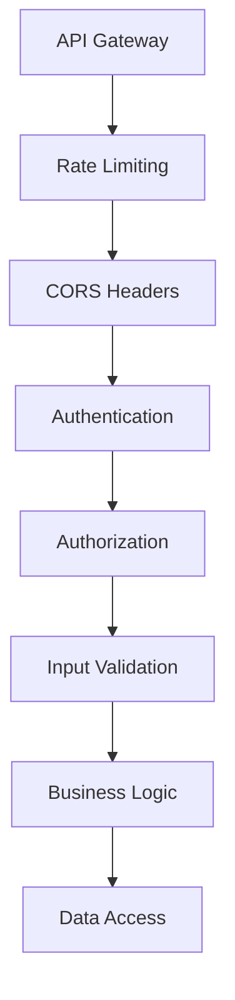

# Spring Security Guide

> **📖 Reading Guide**
> 
> **⏱️ Reading Time:** 5 minutes | **🟡 Level:** Intermediate
> 
> **📋 Prerequisites:** HTTP fundamentals, basic API experience  
> **🎯 Key Topics:** Authentication, Security
> 
> **📊 Complexity:** 11.8 grade level • 1.3% technical density • fairly difficult

## What You'll Learn

This guide shows you how to:
- Protect your APIs from attacks
- Set up user login
- Control resource access
- Test your security
- Block bad requests

## Why Security Matters

Security keeps your data safe. It protects your users. Without security, attackers can steal data. They can break your app. This guide helps you build secure APIs.

## Security Basics

We use five core ideas:

- **Multiple Layers**: Add many security checks
- **Minimum Access**: Give users only what they need
- **Secure by Default**: Build security in first
- **Resource Permissions**: Control access to each item
- **Verify Everything**: Check all requests

## Security Topics

### 1. [OAuth2 Resource Server](oauth2-resource-server.md)
**User Login**

Learn to verify who users are. You'll learn:
- How to check login tokens
- How to get user permissions
- Setup for blocking or async code
- How to handle login errors

**You'll Learn:**
- Accept login tokens
- Read user data from tokens
- Check token signatures
- Set up security

### 2. [Authorization Patterns](authorization-patterns.md)
**Control Access**

Learn to limit what users can do. You'll learn:
- How to set resource permissions
- How to check permissions
- How to verify ownership
- How to decide access

**You'll Learn:**
- Map permissions
- Build security code
- Write access rules
- Avoid mistakes

### 3. [Security Context Propagation](security-context-propagation.md)
**Share Security Data**

Learn to pass security between services. You'll learn:
- How to set up client calls
- How to pass security data
- How to forward tokens
- How to track requests

**You'll Learn:**
- Set up WebClient
- Forward tokens
- Create service accounts
- Track request IDs

### 4. [CORS and Headers](cors-and-headers.md)
**Block Browser Attacks**

Learn to add security headers. You'll learn:
- How to allow cross-domain requests
- How to add protective headers
- How to stop code injection
- How to force HTTPS

**You'll Learn:**
- Set up CORS
- Add headers
- Build content rules
- Check headers

### 5. [Rate Limiting and Protection](rate-limiting-and-protection.md)
**Stop Bad Traffic**

Learn to block attackers. You'll learn:
- How to limit requests
- How to stop brute force
- How to prevent overload
- How to clean inputs

**You'll Learn:**
- Add rate limits
- Detect attacks
- Clean user inputs
- Monitor events

### 6. [Security Testing](security-testing.md)
**Test Security**

Learn to verify security works. You'll learn:
- How to test login
- How to test permissions
- How to test rate limits
- How to test attack blocking

**You'll Learn:**
- Set up tests
- Create test tools
- Test with containers
- Audit patterns

## How Security Works

### Two Code Styles

We support two ways to code:

- **Blocking (Spring MVC)**: Wait for each request
- **Async (WebFlux)**: Handle many at once

Both use the same security.

### Permission Model

We use resource permissions, not roles:

- **Resource Permissions**: Actions like `order:view` or `order:create`
- **Simple Decisions**: Allow or deny
- **Method Security**: Check in your code
- **Double Check**: Check again in business logic

### Security Layers

Each request goes through many checks:



## Quick Start

### 1. Set Up Login

Accept login tokens:

```java
@Configuration
@EnableWebSecurity
@EnableMethodSecurity
public class SecurityConfig {
    
    @Bean
    public SecurityFilterChain securityFilterChain(HttpSecurity http) throws Exception {
        http
            .authorizeHttpRequests(auth -> auth.anyRequest().authenticated())
            .oauth2ResourceServer(oauth2 -> oauth2
                .jwt(Customizer.withDefaults()));
        return http.build();
    }
}
```

### 2. Define Permissions

Create resource permissions:

```java
public final class OrderServicePermissions {
    public static final String VIEW_ORDERS = "order:view";
    public static final String CREATE_ORDERS = "order:create";
    public static final String UPDATE_ORDERS = "order:update";
}
```

### 3. Check Permissions

Require permissions:

```java
@Service
public class OrderService {
    
    @PreAuthorize("hasAuthority('RESOURCE_order:view')")
    public OrderDto getOrder(UUID orderId) {
        // Also check ownership here
    }
}
```

### 4. Limit Requests

Prevent spam:

```java
@Configuration
public class RateLimitingConfig {
    
    @Bean
    public RedisRateLimiter redisRateLimiter() {
        return new RedisRateLimiter(10, 20); // 10 per second, burst 20
    }
}
```

## Settings

### Basic Setup

Set up security:

```yaml
# Set up login token checking
spring:
  security:
    oauth2:
      resourceserver:
        jwt:
          issuer-uri: https://auth.example.com/realms/services

# Set up rate limiting
app:
  rate-limiting:
    enabled: true
    default-limit: 100
    window-seconds: 60

# Set up cross-domain requests
app:
  cors:
    allowed-origins:
      - https://app.example.com
      - https://admin.example.com
    allowed-methods:
      - GET
      - POST
      - PUT
      - DELETE
```

## Security Checklist

### Login Setup ✅
- [ ] Set up token validation
- [ ] Check token signatures
- [ ] Handle expired tokens
- [ ] Extract user permissions

### Access Control ✅
- [ ] Define resource permissions
- [ ] Add permission checks to methods
- [ ] Verify resource ownership
- [ ] Create access decision services

### Attack Prevention ✅
- [ ] Add rate limits to endpoints
- [ ] Validate and clean inputs
- [ ] Protect against SQL injection
- [ ] Prevent code injection attacks
- [ ] Block brute force attempts

### Headers and Cross-Domain ✅
- [ ] Add security headers
- [ ] Define CORS policies
- [ ] Validate content types
- [ ] Set frame options

### Testing ✅
- [ ] Test login flows
- [ ] Test permission checks
- [ ] Test rate limits
- [ ] Test security headers
- [ ] Test attack prevention

## Common Patterns

### Gateway Limits

Limit at the gateway:

```yaml
# Limit requests at the gateway
spring:
  cloud:
    gateway:
      routes:
        - id: order-service
          uri: lb://order-service
          filters:
            - name: RequestRateLimiter
              args:
                redis-rate-limiter.replenishRate: 10
                redis-rate-limiter.burstCapacity: 20
```

### Mesh Security

Control mesh access:

```yaml
# Control service-to-service access
apiVersion: security.istio.io/v1beta1
kind: AuthorizationPolicy
metadata:
  name: order-service-authz
spec:
  selector:
    matchLabels:
      app: order-service
  rules:
  - from:
    - source:
        principals: ["cluster.local/ns/default/sa/api-gateway"]
```

## Best Practices

### Setup Tips
- Use different settings per environment
- Store secrets securely
- Update dependencies often
- Monitor security events

### Speed Tips
- Cache permissions when safe
- Use fast rate limits
- Order filters well
- Measure overhead

### Monitoring Tips
- Log all security events
- Monitor in real time
- Test often for bugs
- Follow OWASP standards

## Related Guides

- [Configuration Principles](../configuration/configuration-principles.md)
- [Logging and Monitoring](../observability/logging-and-monitoring.md)
- [Integration Testing Fundamentals](../testing/integration-testing/integration-testing-fundamentals.md)

---

Each guide has code for blocking and async styles. Start with OAuth2 to set up login. Then read authorization to control access.