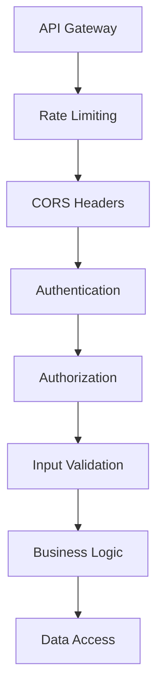

# Spring Security Implementation Guide

## Overview

This directory contains comprehensive security implementation patterns for Spring Boot microservices. These documents provide detailed guidance for implementing OAuth 2.0/OIDC authentication, binary resource-based authorization, service-to-service security, and comprehensive attack protection mechanisms.

## Security Architecture

Our security implementation follows these core principles:

- **Defense in Depth**: Multiple layers of security controls
- **Least Privilege**: Grant only minimum necessary access
- **Secure by Default**: Security applied by default, not as afterthought
- **Binary Resource-Based Authorization**: Fine-grained permissions instead of traditional RBAC
- **Zero Trust**: Verify everything, trust nothing

## Documentation Structure

### 1. [OAuth2 Resource Server](OAuth2-Resource-Server.md)
**OAuth 2.0/OIDC Authentication Configuration**

- JWT token validation and signature verification
- Custom authority extraction from JWT claims
- Imperative (Spring MVC) and reactive (WebFlux) configurations
- Security principles and best practices
- Error handling and token management

**Key Topics:**
- Resource server configuration
- JWT authentication converters
- Token validation properties
- Security context setup

### 2. [Authorization Patterns](Authorization-Patterns.md)
**Binary Resource-Based Authorization Implementation**

- Custom binary resource permission model
- Method-level security with `@PreAuthorize`
- Resource ownership verification
- Access decision services for both programming models
- Defense in depth authorization patterns

**Key Topics:**
- Permission mapping and constants
- Security service implementation
- Access decision logic
- Authorization anti-patterns to avoid

### 3. [Security Context Propagation](Security-Context-Propagation.md)
**Service-to-Service Security and Context Management**

- OAuth 2.0 client configuration for service communication
- Security context propagation between microservices
- Token relay and client credentials flow
- Correlation ID and request tracing
- Custom security headers propagation

**Key Topics:**
- WebClient security configuration
- Token relay patterns
- Service account setup
- Request correlation and tracing

### 4. [CORS and Headers](CORS-and-Headers.md)
**Cross-Origin Resource Sharing and Security Headers**

- Environment-specific CORS configuration
- Comprehensive security headers implementation
- Content Security Policy (CSP) configuration
- HTTP Strict Transport Security (HSTS)
- XSS prevention and content type protection

**Key Topics:**
- CORS policy configuration
- Security headers filter implementation
- CSP policy building
- Header validation and compliance

### 5. [Rate Limiting and Protection](Rate-Limiting-and-Protection.md)
**Rate Limiting and Attack Protection Mechanisms**

- Redis-based rate limiting with Bucket4j
- Brute force protection services
- DDoS protection and connection limiting
- Input validation and sanitization
- SQL injection and XSS prevention

**Key Topics:**
- Rate limiting algorithms
- Attack detection and prevention
- Input sanitization services
- Security monitoring and logging

### 6. [Security Testing](Security-Testing.md)
**Comprehensive Security Testing Patterns**

- Authentication and authorization testing
- JWT token testing utilities
- Rate limiting integration tests
- Security headers verification
- SQL injection and XSS protection tests

**Key Topics:**
- Security test configuration
- Custom test annotations
- Integration testing with Testcontainers
- Security audit testing patterns

## Implementation Patterns

### Dual Programming Model Support

All security implementations support both:

- **Imperative (Spring MVC)**: Traditional blocking I/O with servlet-based security
- **Reactive (WebFlux)**: Non-blocking I/O with reactive security chains

### Binary Resource-Based Authorization

Instead of traditional role-based access control (RBAC), we implement:

- **Resource Permissions**: Fine-grained permissions like `order:view`, `order:create`
- **Binary Access Control**: Simple allow/deny decisions based on resource ownership
- **Method-Level Security**: `@PreAuthorize` annotations with resource permissions
- **Secondary Verification**: Additional ownership checks in service layer

### Security Layers



## Quick Start Guide

### 1. Basic OAuth 2.0 Setup

```java
@Configuration
@EnableWebSecurity
public class SecurityConfig extends WebSecurityConfigurerAdapter {
    
    @Override
    protected void configure(HttpSecurity http) throws Exception {
        http
            .oauth2ResourceServer()
                .jwt()
                .jwtAuthenticationConverter(jwtAuthenticationConverter());
    }
}
```

### 2. Resource Permission Definition

```java
public final class OrderServicePermissions {
    public static final String VIEW_ORDERS = "order:view";
    public static final String CREATE_ORDERS = "order:create";
    public static final String UPDATE_ORDERS = "order:update";
}
```

### 3. Method-Level Security

```java
@Service
public class OrderService {
    
    @PreAuthorize("hasAuthority('RESOURCE_order:view')")
    public OrderDto getOrder(UUID orderId) {
        // Implementation with secondary ownership check
    }
}
```

### 4. Rate Limiting Configuration

```java
@Configuration
public class RateLimitingConfig {
    
    @Bean
    public RedisRateLimiter redisRateLimiter() {
        return new RedisRateLimiter(10, 20); // 10 requests/sec, burst 20
    }
}
```

## Configuration Examples

### Application Properties

```yaml
# OAuth 2.0 Resource Server
spring:
  security:
    oauth2:
      resourceserver:
        jwt:
          issuer-uri: https://auth.example.com/realms/services

# Rate Limiting
app:
  rate-limiting:
    enabled: true
    default-limit: 100
    window-seconds: 60

# CORS Configuration
app:
  cors:
    allowed-origins:
      - https://app.example.com
      - https://admin.example.com
    allowed-methods:
      - GET
      - POST
      - PUT
      - DELETE
```

## Security Checklist

### Authentication ✅
- [ ] OAuth 2.0/OIDC resource server configured
- [ ] JWT signature validation enabled
- [ ] Token expiration handling implemented
- [ ] Custom authority extraction from JWT claims

### Authorization ✅
- [ ] Binary resource-based permissions defined
- [ ] Method-level security annotations applied
- [ ] Resource ownership verification implemented
- [ ] Access decision services configured

### Attack Protection ✅
- [ ] Rate limiting implemented per endpoint
- [ ] Input validation and sanitization enabled
- [ ] SQL injection protection configured
- [ ] XSS prevention mechanisms in place
- [ ] Brute force protection implemented

### Headers and CORS ✅
- [ ] Security headers configured (CSP, HSTS, etc.)
- [ ] CORS policies defined for all environments
- [ ] Content type validation enabled
- [ ] Frame options and referrer policy set

### Testing ✅
- [ ] Authentication tests implemented
- [ ] Authorization tests with proper mocking
- [ ] Rate limiting integration tests
- [ ] Security headers verification tests
- [ ] Attack protection tests (SQL injection, XSS)

## Common Integration Patterns

### API Gateway Integration

```yaml
# API Gateway rate limiting
spring:
  cloud:
    gateway:
      routes:
        - id: order-service
          uri: lb://order-service
          filters:
            - name: RequestRateLimiter
              args:
                redis-rate-limiter.replenishRate: 10
                redis-rate-limiter.burstCapacity: 20
```

### Service Mesh Security

```yaml
# Istio security policy
apiVersion: security.istio.io/v1beta1
kind: AuthorizationPolicy
metadata:
  name: order-service-authz
spec:
  selector:
    matchLabels:
      app: order-service
  rules:
  - from:
    - source:
        principals: ["cluster.local/ns/default/sa/api-gateway"]
```

## Best Practices Summary

### Security Configuration
- Use environment-specific security configurations
- Implement proper secret management with external systems
- Regular security audits and dependency updates
- Monitor security events and implement alerting

### Performance Considerations
- Cache authorization decisions appropriately
- Use efficient rate limiting algorithms
- Optimize security filter chains
- Monitor security overhead impact

### Monitoring and Compliance
- Log all security events for audit purposes
- Implement real-time security monitoring
- Regular penetration testing and vulnerability assessments
- Compliance with security standards (OWASP, etc.)

## Related Documentation

- [Configuration Principles](../configuration/Configuration-Principles.md)
- [Logging and Monitoring](../observability/Logging and Monitoring.md)
- [Integration Testing Fundamentals](../testing/integration-testing/Integration-Testing-Fundamentals.md)

---

For specific implementation details and code examples, refer to the individual documentation files in this directory. Each document provides comprehensive coverage of its respective security domain with both imperative and reactive implementation patterns.